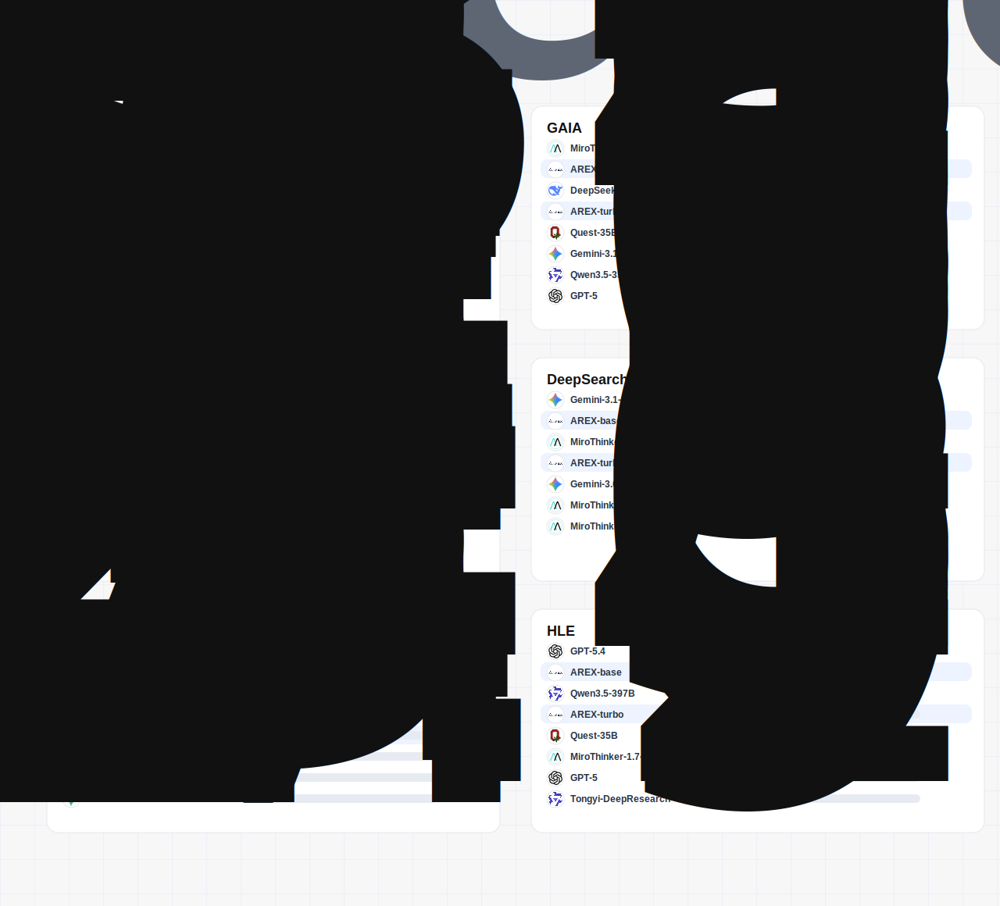

# AREX

**Efficient Long-Horizon Research Agents**

## Overview

AREX is a family of foundation models for research agents, designed for long-horizon deep research. We believe a real research agent should be not only capable, but also efficient: it should gather the most useful information within limited interaction steps, inference budgets, and deployment costs.

AREX focuses on agentic research workflows that require deep search, multi-step reasoning, context management, and evidence synthesis. It can browse and retrieve information across sources, keep track of intermediate findings, decide when to compress or preserve context, and produce grounded answers for open-ended research problems.

## Table of Contents

- [News](#news)
- [Introduction](#introduction)
- [Model Variants](#model-variants)
- [Key Capabilities](#key-capabilities)
- [Use Cases](#use-cases)
- [Benchmark Evaluation](#benchmark-evaluation)
- [Resources](#resources)
- [Citation](#citation)
- [Star History](#star-history)

## News

- **[2026-06-30]** The AREX project page is online.

## Introduction

Many long-context and agent systems rely on hard truncation, fixed summarization, or simply larger inference budgets. AREX instead treats research as an active decision process. At each step, the model learns to choose whether it should search, read, verify, write notes, compress old reasoning, retrieve key evidence, or stop and synthesize.

This efficiency-first design helps reduce unnecessary tool calls and inference latency while preserving the reasoning and evidence-tracking behavior required by deep research tasks.

## Model Variants

| Model | Deployment Profile | Intended Use |
| --- | --- | --- |
| AREX-Turbo | Dense, low-latency option | Resource-constrained serving, rapid research loops, and cost-sensitive agent deployments |
| AREX-Base | Sparse-expert option | Stronger long-horizon reasoning and tool-use performance at controlled active compute cost |

## Key Capabilities

- **Efficiency-First Search**: Optimizes each interaction for useful information gain, reducing unnecessary browsing, inference cost, and response latency.
- **Agentic Context Management**: Treats context as an active workspace. AREX can decide when to preserve notes, compress old reasoning, and retrieve important evidence.
- **Robust Tool Use**: Supports complex browsing, retrieval, data analysis, and expert-style verification workflows across multiple rounds.
- **Long-Horizon Reasoning**: Decomposes complex questions, follows intermediate findings, reconciles evidence, and synthesizes final answers.

## Use Cases

- Automated scientific literature review and evidence synthesis.
- Multi-round commercial, market, and competitor research across websites.
- Question answering systems that require complex reasoning chains and tool calls.
- Autonomous analysis of long documents spanning dozens or hundreds of pages.

## Benchmark Evaluation

AREX is evaluated on public benchmarks covering browsing, retrieval, long-horizon reasoning, tool use, and open-domain deep search.

Covered benchmarks include:

- **BrowseComp** and **WideSearch** for browsing and retrieval.
- **HLE**, **HLE with Tools**, and **GAIA** for long-horizon reasoning and tool interaction.
- **DeepSearchQA** and **x-bench-2510** for open-domain deep search.

## Resources

| Resource | Link |
| --- | --- |
| Paper | Coming soon |
| AREX-Turbo | Coming soon |
| AREX-Base | Coming soon |
| Project Page | [`web/index.html`](web/index.html) |

## Citation

Citation information will be added when the paper is available.

## Star History

